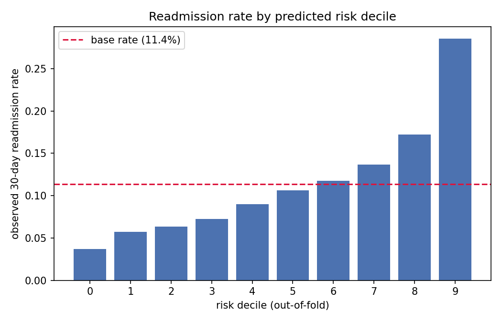
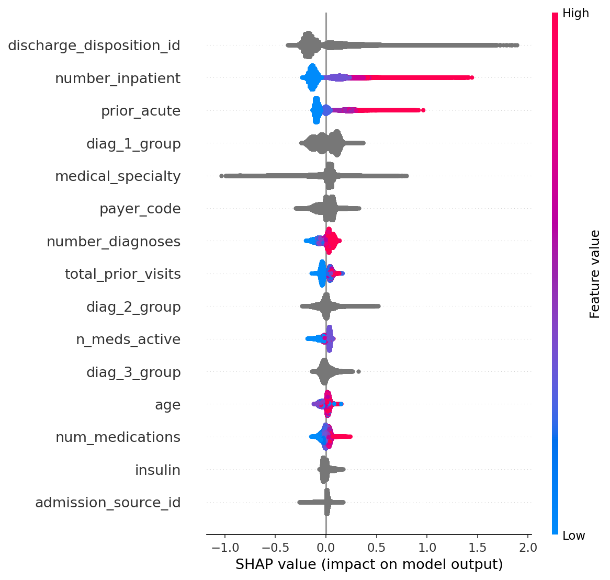
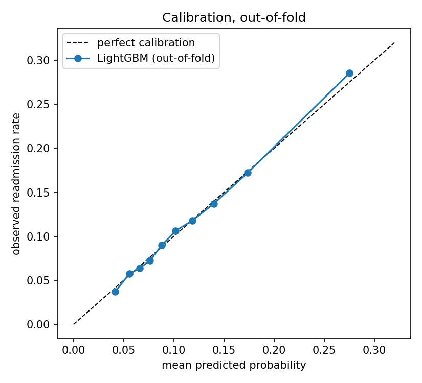
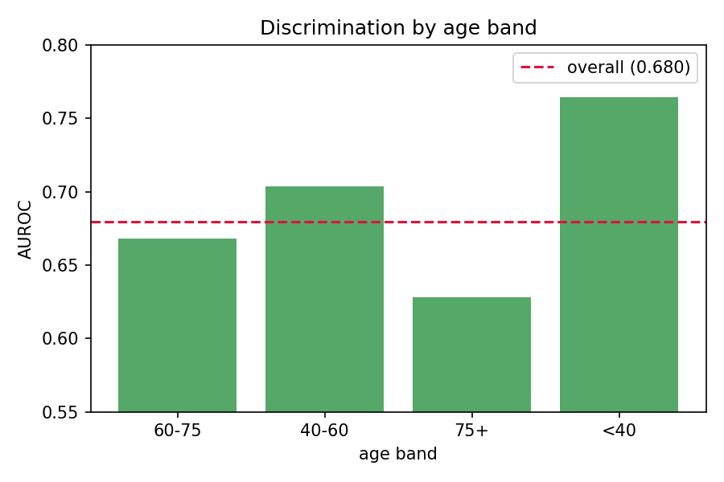

# 30-Day Hospital Readmission Prediction

**Predicting which diabetic inpatients will be readmitted within 30 days and why, on 100k hospital encounters from 130 US
hospitals.**

| | |
|---|---|
| **Problem** | Hospitals are penalized by Medicare (CMS HRRP) for excess 30-day readmissions. Identifying high-risk patients at discharge lets care teams target limited follow-up capacity. |
| **Data** | [UCI Diabetes 130-US Hospitals](https://archive.ics.uci.edu/dataset/296/diabetes+130-us+hospitals+for+years+1999-2008): 101,766 encounters, 50 features, 1999–2008. ~11% readmitted within 30 days. |
| **Approach** | Logistic regression → tuned LightGBM → PyTorch MLP with categorical embeddings. Domain-driven cleaning, ICD-9 grouping, SHAP interpretation, calibration and fairness audits. |
| **Result** | LightGBM, AUROC **0.68**, and **2.5x lift** in the top risk decile: targeting the top 10% of discharges finds patients who readmit at 28.5% vs 11.4% at random. |
| **Takeaway** | Prior utilization and discharge destination dominate risk; a neural net did not beat gradient boosting; and a suspected data-leakage trap turned out not to matter (verified by experiment). |

Everything below reports **out-of-fold** performance (5-fold patient-grouped
cross-validation), so no number reflects data the model trained on.

---

## Results

| Model | AUROC | AUPRC | Precision@10% | Notes |
|---|---|---|---|---|
| Logistic regression | 0.664 | 0.215 | 0.264 | scaled, one-hot, L2 |
| **LightGBM** | **0.680** | **0.237** | **0.285** | 5-fold grouped CV, tuned |
| PyTorch MLP | 0.673 | 0.235 | 0.279 | embeddings, single holdout |

All three rows are evaluated on the same 99,343 encounters with the same
features. Logistic regression and LightGBM use 5-fold patient-grouped
cross-validation; the MLP uses a single 80/20 holdout, so its figure carries
more variance.

Baselines for context: AUPRC baseline (random) is 0.114, so 0.237 is a **2.08x**
lift; the Brier baseline (predicting the base rate) is 0.1009, beaten at 0.0955.

Gradient boosting beat the linear baseline by 0.016 AUROC and 0.022 AUPRC, and
slightly edged the neural network. The small spread across three very different
model families suggests the signal in this data is close to additive: there are
few strong feature interactions for a tree ensemble to exploit, and neither the
data volume nor the feature complexity gives deep learning an edge. This is the
expected outcome on tabular data of this size.

**Operationally**, the model separates a 3.7% risk decile from a 28.5% risk
decile, with risk rising monotonically across all ten deciles. For a care team
that can follow up with 10% of discharges, that is 2.5x more readmissions caught
per outreach call than random selection.



## What drives readmission



The top three features carry ~40% of total attributed impact:

| Rank | Feature | Mean \|SHAP\| |
|---|---|---|
| 1 | Discharge disposition | 0.202 |
| 2 | Prior inpatient visits | 0.171 |
| 3 | Combined prior acute care | 0.109 |
| 4 | Primary diagnosis group | 0.084 |
| 5 | Admitting specialty | 0.077 |

- **Prior utilization dominates.** Readmission rises monotonically with prior
  inpatient stays: 8.6% (zero) → 13.3% → 17.9% → 31.4% (four or more). The
  heaviest-utilizing patients readmit at **3.7x** the rate of those with none.
- **Discharge destination is the single strongest feature.** Discharge to
  inpatient rehab carries 27.7% readmission vs 9.3% for discharge home, a
  transition point where an intervention could plausibly be placed.
- **Age ranks only 12th.** What predicts readmission is not how old a patient
  is, but how much acute care they have recently needed.
- **Payer code ranks 6th.** Its predictive power likely reflects access barriers
  and socioeconomic position rather than clinical risk, worth flagging before
  any deployment.

## Calibration



Predicted probabilities are accurate to within ~1 percentage point across the
full range: a patient scored 0.25 readmits about 25% of the time. This makes the
output usable for capacity planning, not just ranking. No resampling (SMOTE) or
class weighting was used, since both improve apparent recall at a fixed
threshold but distort probabilities, and calibrated output was judged more
valuable.

## Fairness audit



Calibration is stable across race, sex, and age, no subgroup gap exceeds 0.6
percentage points, so no group is systematically over or under scored.

Discrimination is less uniform: AUROC falls from 0.76 (under 40) to **0.63 (75+)**,
the group with both the highest prevalence (12.5%) and the largest sample
(19,023). The model ranks least effectively where risk is greatest likely
because utilization-history features saturate in elderly patients, and because
readmission there depends on factors absent from billing data (frailty,
functional status, caregiver support). A deployed policy should allocate
follow-up capacity within age strata, not on a single pooled threshold.

## Methodology highlights

**Patient-level leakage was tested, not assumed.** 29.7% of rows are repeat
encounters (one patient appears 40 times). The textbook move is to restrict to
first encounters, since a random split could let a model memorize individuals.
Running naive-random and patient-grouped splits on identical data gave
**identical results** (AUROC 0.6792 both ways) and the gap stayed zero even
with a deliberately over-parameterized model. The features are too coarse to
fingerprint individuals, so encounter-level modeling is used as primary, with
patient-grouped CV kept as the correct default.

**Nothing is imputed.** Every missing value is missing for a structural reason.
`A1Cresult` (82% absent) and `max_glu_serum` (95%) record tests that were never
ordered and whether an A1C was ordered is the central finding of Strack et al.
(2014), so these are encoded as explicit categories rather than filled in.

**ICD-9 grouping, extended.** The three diagnosis columns hold 716/748/787
distinct codes, grouped by numeric range per Strack et al. Their nine-category
scheme left 17% of primary diagnoses in a catch-all `Other`; inspecting it
revealed four coherent blocks (infectious, endocrine/metabolic, blood, mental
health). Since sepsis and psychiatric comorbidity are established risk factors,
these were split out, shrinking `Other` to ~9%.

**Impossible outcomes removed.** 2,423 encounters ended in death or hospice
transfer, patients who cannot be readmitted, and are mislabeled negatives
rather than hard cases.

## Limitations

- **Data vintage.** 1999–2008, ICD-9, pre-ACA, would not transfer to a current
  population without retraining.
- **Performance ceiling.** Published results cluster at 0.65–0.70 AUROC; billing
  data omits the strongest plausible drivers (adherence, social support,
  housing, follow-up access).
- **Outcome definition.** Late readmissions (>30 days, 35% of encounters) fall
  in the negative class, matching the CMS window but mixing stable patients
  with later returns.
- **Elderly discrimination gap.** See fairness audit.

## Reproduce

```bash
python -m venv .venv
.venv\Scripts\Activate.ps1     # Windows
pip install -r requirements.txt
pip install -e .
pytest -v                       # 24 tests
```

Download `diabetic_data.csv` and `IDS_mapping.csv` from the UCI link into
`data/raw/` (not committed).

## Layout

```
src/
  load_data.py   # loading + schema validation
  clean.py       # filtering, variance pruning, target construction
  icd9.py        # ICD-9 code grouping
  features.py    # feature engineering, preprocessing, splits
  models.py      # logistic regression, LightGBM
  mlp.py         # PyTorch MLP with categorical embeddings
  evaluate.py    # AUROC, AUPRC, Brier, precision@k
tests/           # 24 tests
notebooks/01_eda.ipynb
reports/figures/
```